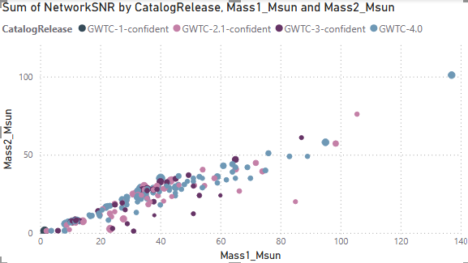
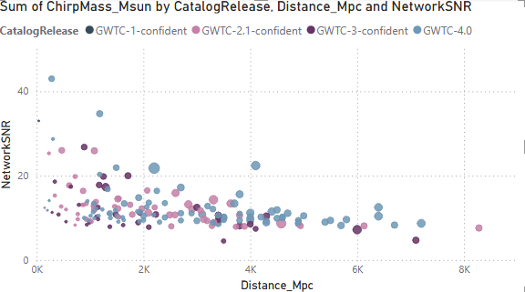
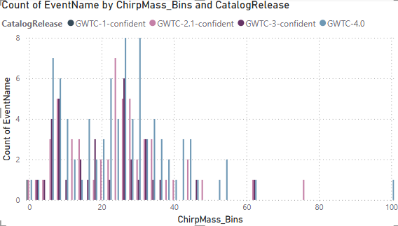
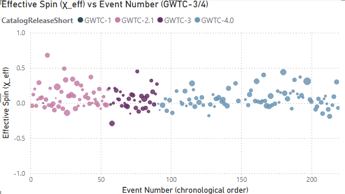

# LIGO Gravitational Wave Catalog Dashboard (Power BI)

This project is an interactive Power BI dashboard built from the **LIGO–Virgo–KAGRA Gravitational-Wave Transient Catalog (GWTC)**. It visualizes black hole and neutron star merger events from GWTC-1 through GWTC-4 using real open data from the Gravitational Wave Open Science Center (GWOSC).

## Data

- Source: Gravitational Wave Open Science Center (GWOSC) – GWTC event catalogs  
- Content: One row per event, including component masses, chirp mass, luminosity distance, network SNR, effective spin (χ_eff), and catalog release flags.

The raw event table was cleaned and lightly transformed in Power BI (e.g., derived mass ratio, chirp-mass bins, and simple log-distance fields).

## Key Terms in the LIGO Power BI Dashboard

**NetworkSNR:** The combined signal-to-noise ratio from all LIGO/Virgo detectors, measuring how “loud” or confidently detectable a gravitational-wave event was.

**Distance_Mpc:** The luminosity distance to the merger in megaparsecs (Mpc), representing how far away the signal originated in the universe.

**CatalogRelease:** The official dataset (GWTC-1, GWTC-2.1, GWTC-3, GWTC-4) in which the event was published, corresponding to different LIGO/Virgo observing runs.

**ChirpMass_MSun:** A specific combination of the two black hole masses (in solar masses) that largely determines the frequency evolution—or "chirp"—of the gravitational-wave signal.

**Mass1_Msun:** The estimated mass of the heavier object in the binary system, measured in solar masses.

**Mass2_Msun:** The estimated mass of the lighter object in the binary system, measured in solar masses.

**ChirpMass_Bins:** Grouped ranges (bins) of chirp mass used for histograms, revealing the distribution of event types (e.g., neutron-star vs black-hole systems).

**EventName:** The official LIGO/Virgo identifier of each gravitational-wave event, usually containing the date of detection (e.g., GW150914).

**Event Number (EventIndex):** The chronological index of events, allowing trends to be seen over time independent of catalog or naming.

**Effective Spin (χ_eff):** A quantity between –1 and +1 measuring how much the black holes’ spins are aligned with the orbital angular momentum; it influences the waveform shape and encodes astrophysical formation clues.

## Dashboard Features

- **Mass1 vs Mass2 Scatterplot (ligo1)**

  <figure>
  
</figure>  
  This plot shows the masses of the two objects in each merger. Most points line up along a diagonal, revealing that many binaries have similar masses. Larger dots represent louder signals detected on Earth. The dense cluster of moderate-mass pairs corresponds to typical black-hole mergers, while the handful of low-mass pairs represents neutron-star collisions. Very heavy systems (far to the right and top) are rare but produce some of the strongest gravitational-wave events.
</figure>
  

- **Network SNR vs Distance_MPC (ligo2)**

  <figure>
  
</figure>
  Each dot represents a real gravitational-wave merger, showing how the strength of the signal (SNR) decreases as the event’s distance increases. Larger bubbles correspond to higher-mass systems, which produce louder signals and can be detected even from farther away. This chart makes clear why LIGO sees some massive black-hole mergers across billions of light-years while smaller or quieter events fade below detection limits at large distances.
</figure>
  

- **Chirp Mass Histogram (ligo3)**

  <figure>
  
</figure>
   This histogram shows how often LIGO detects mergers of different “chirp masses,” a special combination of the two objects’ masses that controls the pitch of the gravitational-wave signal. Most events cluster around ~20–35 solar masses, which represent typical stellar-mass black hole mergers. The small-mass bars on the left represent neutron-star collisions, while the high-mass tail shows rare heavy black hole mergers.
</figure>
  

- **Effective Spin (χ_eff) vs Event Number (ligo5)**

  <figure>
  
</figure>
 
  This chart tracks how the “effective spin” of merging black holes and neutron stars changes over LIGO’s observing runs. χ_eff tells us whether the two objects’ spins were aligned with their orbit when they merged. Most events cluster near zero, meaning the spins were not strongly aligned — an important clue suggesting that many binaries formed dynamically rather than as long-term pairs. Over time, the overall distribution stays similar, showing that the cosmic population of mergers has remained stable across LIGO’s observing years.

## How to Use

1. Download `GWTC_Events.pbix` from this folder.
2. Open it in **Microsoft Power BI Desktop** (free download from Microsoft).
3. Use the slicers and filters to:
   - focus on specific catalogs (e.g., GWTC-3 only),
   - explore different mass ranges,
   - examine how SNR and distance interact with mass and spin.

If you want to reproduce or extend the model, you can start from the provided Excel/CSV event table (`gwtc_events.xlsx`) or swap in newer GWTC releases.

## Methods and Analysis

- Working with astrophysics data from GWOSC  
- Data cleaning and feature engineering in Power BI (mass ratio, chirp-mass bins, etc.)  
- Designing publication-style scientific visuals (scatterplots, histograms, spin vs event number)  
- Communicating physical insights about black hole masses, spins, and selection effects in a dashboard format

## Credits

- Data from the **LIGO–Virgo–KAGRA Collaboration** via the Gravitational Wave Open Science Center (GWOSC).  
- Interpretation and visual design by Davis Whaley.
